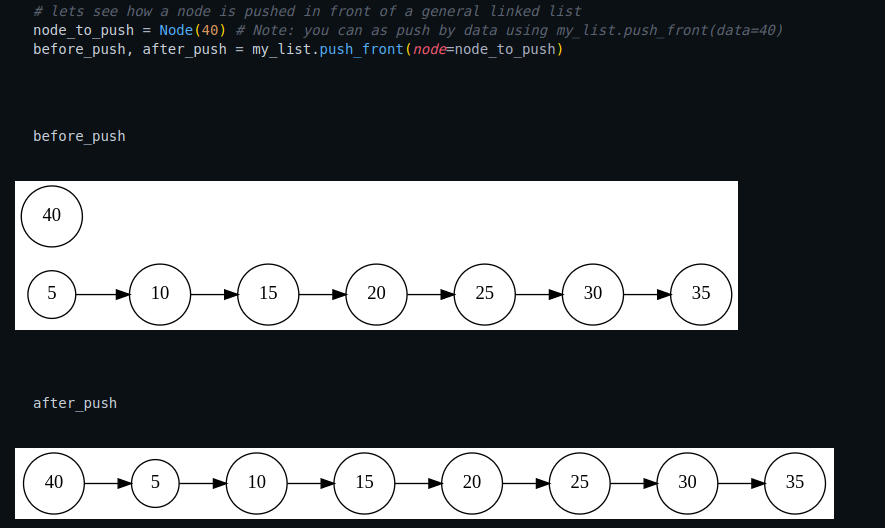

# Linked List Visualisation Tool
- This is a simple tool I built to learn a little about the [graphviz](https://graphviz.org/) library
- This tool gives you a visual aid to see how the basic operations take place in a linked list.
- Looking forward to suggestions and pull requests.

## Sample

